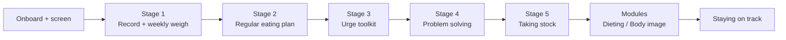

# Midmorning: V1 PRD

24 September 2026 · Ash Booth

## Summary

Midmorning is an iOS self-help companion that walks an adult with recurrent binge eating through a 12-week CBT-E based programme, with two things at its core: a real-time eating record that takes under 20 seconds to fill in, and a regular eating plan the app reminds you to follow. Everything else (urge tools, problem solving, weekly review, the dieting and body image modules, relapse planning) hangs off those two.

The thesis: the book fails in practice at stage 2, not stage 1. People start recording, then stop once regular eating asks them to eat by the clock rather than by feel. An app can hold that structure for them (plan the day, prompt each meal, close the day, review the week) in a way paper cannot. If V1 moves stage 2 completion from a minority to a majority of starters, it has earned a V2.

| Decision | V1 choice | Consequence |
| --- | --- | --- |
| Guidance | Pure self-help, no human in the loop | Weaker evidence base than guided self-help; safeguarding must be built in, not delegated |
| IP | Independent, built on published CBT-E principles | No Fairburn name, no book title, no book text; our own content, clinically reviewed |
| Market | UK, direct to consumer, wellness posture | Intended-purpose wording stays below the MHRA medical device line; no treatment claims |
| Weighing | Weekly in-app weigh-in, as the programme prescribes | Needs a deliberately anti-weight-loss design or it attracts the wrong users |

## Name

The product is called **Midmorning**. Decided 24 September 2026, subject to a UKIPO clearance search and the co-design panel's reaction.

Why this name: it is a slot in the regular eating plan itself (breakfast, mid-morning, lunch, mid-afternoon, evening meal, evening snack), so the name carries the method without saying anything about eating, weight or health. It reads as a clock, calendar or notes app on a lock screen. It is not gendered and not clinical. Across two rounds of naming (50 candidates checked against the App Store), it was the only name with no app, brand or health-space hit under either spelling.

Rules that follow from it:

- The App Store subtitle does the discovery work ("a 12-week programme for binge eating"); the name never does.
- The name must not appear in notifications alongside meal words. "Midmorning, 10:30" is fine; "Midmorning: time for your snack" is not, unless the person has opted into explicit wording.
- The mid-morning plan slot keeps its ordinary label in the app so the product name and the slot do not read as the same thing; the slot is written "Mid-morning", the product "Midmorning".
- Reserves if clearance fails, in order: Halfpast, Bytheclock, Quarterpast, Longhand.

The name cannot reference Fairburn, Oxford or the book, and nothing in the product does.

## Problem and users

Binge eating disorder is the most common eating disorder and the least treated: most people never see a clinician, NHS waits for adult eating disorder services run to months, and the recommended first-line treatment (guided self-help based on CBT-E) is mostly delivered through a paperback and a notebook.

**Who V1 is for.** Adults 18+ in the UK with recurrent binge eating, whether or not they have a diagnosis, who are not underweight, not purging frequently, not pregnant, and not currently in specialist treatment (or whose clinician is happy for them to use it). Roughly a third of people with BED are men; the product must not read as a women's app.

**Who it is not for.** Under 18s. Anyone underweight (BMI under 18.5, and treat 18.5 to 19 with caution). Anyone vomiting or using laxatives more than around twice a week. Pregnancy. Anyone with active thoughts of self-harm. Anyone in medical crisis. These people are screened out at onboarding and, where the record later suggests it, mid-programme, and pointed to their GP and Beat.

**What the book-only experience gets wrong, and where the app earns its place:**

| Book on paper | Failure mode | What the app does instead |
| --- | --- | --- |
| Write the record in a notebook, straight after eating | Notebook is at home, or embarrassing to use in public; entries get back-filled from memory, which is exactly what the method says not to do | Lock-screen widget and notification actions; a record entry is a private, discreet, sub-20-second interaction on a phone that is always present |
| Plan a regular eating pattern and stick to it | Depends on memory and willpower at the worst moments (mid-afternoon, late evening); one missed meal quietly restarts the restrict-binge cycle | The day's plan lives in the app, each meal gets a discreet prompt, and a missed meal triggers a "next one still counts" nudge rather than silence |
| Review the week and look for patterns | Most people never do it; those who do can't see the patterns in handwriting | Auto-summarised week: starred episodes, gaps over four hours, times of day, places; reflection questions built on the actual data |
| Ride out an urge using a list you wrote earlier | The list is in a notebook you aren't holding | An "urge" button that surfaces your list, a timer showing the urge peaking and passing, and a one-tap outcome log |
| Weigh once a week only | Daily weighing creeps back, or the scale is avoided entirely | The app only asks on the chosen day and shows a trend, not a number to fixate on |

**How people arrive.** Self-referral via App Store search, GP suggestion, Beat's resources, or while on a waiting list. Assume they arrive ashamed, sceptical, and having tried a food-tracking app that made things worse. Assume they will look for weight loss and must be told clearly, early, that this is not that.

## Goals and non-goals

V1 succeeds if a majority of people who complete onboarding are still recording and following a regular eating plan at week 4, and if nobody is harmed by it.

**Goals**

1. Make the record effortless: median time from eating to entry under 15 minutes, entry itself under 20 seconds.
2. Get people through stage 2: 55% of onboarded users have a regular eating plan and at least five recorded days in week 3.
3. Reduce binge frequency: self-reported starred episodes per week fall by at least half between week 1 and week 8 for people who reach week 8.
4. Be safe by design: screening, escalation and a support route are in the first release, not a later one.
5. Be private enough that someone would use it on a train: discreet notifications, app lock, no server-side copy of the record.

**Non-goals for V1**

- Weight loss, calorie counting, macros, or any nutritional scoring of what people eat. This is the line that separates the product from the apps that make binge eating worse.
- Diagnosis, or treating restrictive eating disorders (anorexia, ARFID). Screened out.
- A human guide, coach or clinician portal. Designed for, not built (see V2).
- An AI chat companion or AI-generated therapeutic content. The clinical risk of an LLM improvising with someone mid-urge is not one to take in a first release without a clinician review loop.
- Social or community features. Comparison is a trigger.
- Android, web, Apple Watch app (a widget and complications are enough for V1).
- NHS procurement (DTAC) or medical device certification. The architecture should not make these harder later.

## Programme mapping

The programme runs about 12 weeks. Stages unlock in order because the method depends on it (you cannot problem-solve triggers you haven't recorded), but the app never blocks someone from reading ahead; it only gates the *tools*.

Each stage adds a tool on top of the ones before; the record and the plan stay live throughout.

| Stage | What the programme asks | App feature | Unlocks when | Typical length |
| --- | --- | --- | --- | --- |
| Getting started | Record everything eaten, in real time; weigh once a week | The Record; weekly weigh-in; short psychoeducation cards | Day 1 | 1 week |
| Regular eating | Plan 3 meals + 2 to 3 snacks, no gaps over 4 hours awake; phase out compensating | Plan builder; per-meal reminders; plan vs actual overlay; compensation taper (if relevant) | After 5 recorded days | 2 to 3 weeks, then ongoing |
| Alternatives to binge eating | Build a list of things to do when an urge hits; learn urges peak and pass | Urge button; personal alternatives list; urge timer; outcome log | After 7 days on a plan | 1 week, then ongoing |
| Problem solving | Spot triggers in the record; work them through step by step | Pattern surfacing from the record; guided six-step worksheet; saved solutions | After first urge logged | 2 weeks, then ongoing |
| Taking stock | Review progress; decide which modules apply | Structured week-6 review with data; module recommender | Week 6 | 1 session |
| Dieting module | Loosen food rules; reintroduce avoided foods; stop under-eating | Rules and avoided-foods list; graded reintroduction ladder; gap monitor | From taking stock | 3 to 4 weeks |
| Body image module | Reduce body checking and avoidance; work with "feeling fat" | Body checking log; "feeling fat" diary linking to mood and events | From taking stock | 3 to 4 weeks (content-led in V1) |
| Staying on track | Write a maintenance plan; treat lapses as slips | Maintenance plan builder; reduced-cadence mode; post-programme check-ins | Week 10 to 12 | Open-ended |

Pacing is the app's, not a calendar's: someone who records for three days in a week does not advance. That is the method, and it is also the main retention risk (see Risks).

## Core feature specs

### 1. Onboarding and screening

Four screens, under three minutes, and it should repel the wrong users before it recruits the right ones.

1. **What this is and isn't.** One screen: a structured 12-week self-help programme for binge eating; not a diet, not weight loss, not therapy, not a substitute for a clinician. "Continue" is a deliberate choice.
2. **Screening.** Age; height and weight (for a one-time BMI check that is never shown again after this screen); frequency of vomiting or laxative use; pregnancy; current eating disorder treatment; a single self-harm item. Any exclusion ends onboarding with a warm page: why, what to do instead, GP and Beat contact, and "you can come back if this changes".
3. **Commitment.** Pick a start day (today or tomorrow), a weigh-in day, and quiet hours. Explain the record in three sentences and show one example entry.
4. **Permissions.** Notifications with a specific rationale ("we'll prompt you at meal times you choose"), Face ID lock on by default, widget prompt.

No account creation in V1. Data lives on the device and in the user's private iCloud. This is a privacy decision and a scope decision, and it costs us outcome data (see Metrics).

### 2. The Record

The single most important screen. Design target: an entry in under 20 seconds, one-handed, without looking like a food app to the person next to you.

**Fields, mirroring the paper record:**

| Field | Input | Rules |
| --- | --- | --- |
| Time | Defaults to now; editable | Late entries land in the timeline without any visible mark; latency is recorded only for aggregate metrics (see Design principles) |
| What | Free text or dictation | No food database, no autocomplete of portions or calories, no photos in V1. "Toast and tea" is a complete entry |
| Where | Chips: home, work, out, travelling, custom | Optional |
| Felt like a binge | Single toggle (the book's asterisk) | User's judgement, never inferred by the app |
| Compensated | Vomited / laxatives / other (only shown if screening said this happens) | Hidden for everyone else |
| Context | Free text: thoughts, feelings, what was going on | Optional; prompted gently on starred entries |

**Entry points:** lock-screen widget ("+ Record"), home-screen widget, notification actions on every meal reminder, Siri App Intent ("log a snack"), Control Centre button.

**Day view** looks like the paper record: a time-ordered column, starred entries marked, gaps over four hours awake shown as a soft band (only once stage 2 is unlocked). Entries can be edited or deleted. A day can be marked "didn't record" so gaps are honest rather than ambiguous.

**What it never does:** totals, daily counts of anything except starred episodes, colour-coding food, streaks for "clean" days, or scolding for missed entries. A missed morning gets a single neutral nudge at midday; a missed day gets nothing until the evening close.

**Export:** a PDF of any date range, formatted like the paper record, for taking to a GP or therapist. Small feature, high trust value.

### 3. Regular eating plan

Unlocked after five recorded days. The app helps the person decide *when* to eat, not what.

- **Plan builder.** Drag meals and snacks onto a day: breakfast, mid-morning, lunch, mid-afternoon, evening meal, evening snack. Rules enforced softly: 3 meals and 2 to 3 snacks; no awake gap over four hours (the app shows the gap and asks, it doesn't block). Weekday and weekend templates; a day can be edited the night before or in the morning.
- **Today.** The plan as a timeline with the record overlaid: planned meal, actual entry beside it, a gap where one is missing. This is the home screen once stage 2 starts.
- **Missed meal handling.** If a planned meal passes with no entry, one prompt: "Skipped, or not logged yet?" Skipped triggers the key message of the method in one line: the next planned meal still happens, on time, regardless. Never "make it up", never "you can skip the next one".
- **After a binge.** Same rule, stated plainly: next planned meal goes ahead. No compensation, no extending the gap.
- **Compensation taper** (only for users who reported vomiting or laxatives at screening): weekly count shown, with content on why regular eating removes the need for it. If frequency rises for two weeks, prompt to see a GP.

### 4. Reminders

Every planned meal is a notification at its time, snoozable by 15 or 30 minutes, with actions: **Record it**, **Skipped**, **Not yet**. Plus a morning "set today's plan" (only until the plan is a stable routine), an evening "close the day" (30 seconds: anything not recorded, one feeling word), a weigh-in day reminder, and a weekly review prompt.

Constraints: default notification text is discreet ("1pm" with the app name, not "time for lunch"); the user can choose explicit wording. Hard cap of eight notifications a day. Quiet hours honoured. Every reminder type has its own switch. Time Sensitive interruption level for meal prompts is opt-in.

### 5. Weekly weigh-in

Once a week on the chosen day, and only then. The screen asks for a number (kg or stone and pounds), then shows a four-week rolling average as a line with the individual points de-emphasised, and a one-line explanation that weekly swings of a kilo or two are normal and mean nothing. No goal weight, no BMI, no colour, no target line, no "down 0.4 kg" messaging. If the person weighs on another day the app does not record it and says why.

Safeguard: if the rolling average drops fast, or the one-time BMI from onboarding plus the trend implies the person is approaching underweight, the app raises the "this programme may not be right for you now" page and points to a GP. HealthKit write-through is off by default.

### 6. Urge toolkit

A large, always-visible **Urge** button from stage 3. Tapping it:

1. Starts a 20-minute timer with a simple wave showing the urge peaking and passing.
2. Shows the person's own alternatives list (built in a short setup: things that are active, engaging, or get them out of the kitchen; the app offers examples but the list is theirs).
3. Offers one grounding exercise (breathing or a walk prompt); no lecture.
4. At the end, or whenever they return: **It passed** / **I ate as planned** / **I binged**. All three are logged without judgement; a binge opens a record entry pre-filled with the time and the "felt like a binge" toggle, then the "next meal still happens" line.

### 7. Problem solving

From stage 4. Two halves:

- **Pattern surfacing.** From the record: starred episodes by time of day, day of week, place, and gap length before them. Shown as plain sentences ("5 of your 7 starred entries were after 8pm on days you skipped lunch"), not dashboards. Triggers a suggestion to problem-solve.
- **Six-step worksheet.** Name the problem precisely; list every possible solution without judging; think through each; pick one or a combination; plan the steps; review afterwards. Saved to a personal library and linked to the pattern that prompted it. The review step is scheduled as a reminder a week later.

### 8. Weekly review and taking stock

Every seven days, a review the app builds from the record: starred episodes this week vs last, days with a complete plan followed, longest gaps, compensation count if relevant, weigh-in status. Then three reflection questions and a single "what's the one thing to change next week" field that becomes a pinned note.

At week 6 the review expands into **taking stock**: progress against the person's own week-1 answers, then a short questionnaire on food rules, avoided foods, body checking and avoidance, and "feeling fat", which recommends which module to open. Both can be opened regardless.

### 9. Modules

**Dieting module (full in V1).** Identify food rules ("no carbs after 6") and avoided foods; build a ladder from least to most feared; schedule one reintroduction a week into a planned snack or meal; record how it went. The gap monitor and plan adherence from stage 2 double as the "are you eating enough" check.

**Body image module (content-led in V1).** Psychoeducation on body checking, avoidance and "feeling fat"; one tool, a "feeling fat" diary that captures what was happening and what emotion was underneath. Reducing checking and avoidance is guided by content rather than a tracker in V1, because this is the part of the method least suited to an app and most prone to becoming a body-scrutiny feature if built badly.

### 10. Staying on track

From week 10: a maintenance plan the person writes with prompts (what helped most; early warning signs; what to do at the first slip; who to tell). The app moves to a reduced cadence: record on request, plan reminders optional, a check-in at 4, 8 and 12 weeks after finishing, and a one-tap "restart the programme" that keeps the old plan and lists.

### 11. Content

Each stage has three to five cards of under three minutes' reading, in plain UK English, written by us and reviewed by a clinical psychologist with CBT-E training. Nothing is generated at runtime. Tone: matter-of-fact, never cheerleading, never medical. Every card ends with the one thing to do.

## Design principles for the record

The record is asking someone to write down the thing they are most ashamed of, several times a day, on a device they use for everything else. Standard food-app UX is actively harmful here. These principles govern every screen the record touches and take precedence over the feature specs above where they conflict.

**1. Recording is an observation, never a confession.** The screen that opens after "felt like a binge" is the most important screen in the app. It shows nothing but the time, the entry, and one optional line: "What was going on just before?" No colour change, no icon, no acknowledgement, no "it's okay". The entry saves and the screen closes like any other. Support for the next step ("your 7pm meal still happens") arrives later, at the next planned meal, not on top of the entry.

**2. The person is never shown their own data as evidence against them.** A day with fifteen entries is presented at the same visual weight as a day with five. Starred entries are marked, not highlighted. The day view can be collapsed to a count and expanded on request. Weekly summaries state what happened and what changed, never a score, never a comparison to a "good" week.

**3. Late is fine.** The "logged later" tag is not shown to the person. It exists only to compute the record-latency metric in aggregate. If the person adds an entry the next morning, it lands in the timeline without a mark. The method prefers real-time recording; the app teaches that through the cards, not through labels on entries.

**4. Vocabulary is deliberately ordinary.** The field is "What", the object is an "entry", the screen is "Today". Not meal log, food diary, intake, portion, serving, or calories. "Binge" appears only where the programme uses it (the star, the urge outcome). The star's own label is "felt like a binge", the person's judgement, never the app's.

**5. Nothing looks like a nutrition app.** No plate, fork, apple, scale or tape-measure icons anywhere, including the app icon, widgets and App Store screenshots. No food photography. The visual language is closer to a notes app or a calendar than to a health tracker. Someone glancing at the screen on a train should not be able to tell what it is for.

**6. The record is the person's, and it can be put down.** "Pause for today" is a first-class control on the Today screen: reminders stop, the day is marked as paused, nothing is inferred from it, and the plan resumes tomorrow. The weekly summary and the pattern-surfacing sentences are each opt-out. Delete-all is one tap. Nothing about the record is ever framed as a commitment the person has broken.

**7. Every string is tested for shame before it is tested for clarity.** Copy review asks one question first: could a person who has just binged read this as judgement? Only then does it ask whether it is clear.

### Co-design and testing

The target user's reaction to the record cannot be inferred by a design team without lived experience, and standard usability testing (task completion, time on task) measures the wrong thing.

- **Co-design from the first wireframe.** A paid panel of six to ten people with lived experience of binge eating, recruited through Beat's ambassador network or an eating disorder charity, involved at wireframe, prototype and beta. Two of them should be men.
- **Shame-response testing, not usability testing.** Sessions where participants log a real or scripted binge on the prototype, followed by a structured interview on what they felt, what they wanted to hide, and whether they would open the app again tomorrow. Task success is secondary.
- **Clinical review of the record flow specifically**, separate from content review: a CBT-E trained clinician walks the binge-entry and after-binge paths and signs them off.
- **A named exit criterion for beta.** The record does not ship until a majority of the panel say, unprompted, that they would use it after a bad day.

## Safety and clinical guardrails

With no human in the loop, the app carries the whole duty of care. These are requirements, not preferences.

**Screening and re-screening.** Exclusion criteria at onboarding (section 5.1) are re-checked at every weekly review with two questions: compensation frequency and the self-harm item. The weigh-in trend feeds the underweight check. Any trigger shows the "this may not be right for you now" page, pauses reminders, and keeps the record available so nothing is lost.

**Get support.** A persistent button on every screen: Beat helpline and webchat, Samaritans, NHS 111, 999, and "talk to your GP" with a pre-written paragraph the person can copy. This is not hidden behind a crisis detector; it is always there.

**Deterioration rule.** If starred episodes rise for three consecutive weeks, or compensation appears where it wasn't reported, or the person marks "I'm getting worse" in a review, the app recommends seeing a GP and offers the PDF export to take along. It does not diagnose and does not lock the person out.

**Free-text risk.** V1 does not scan record text for risk language. A keyword classifier would produce false alarms on ordinary entries and false reassurance on real ones, and there is no one on the other end to act on it. This is a deliberate gap, documented, and one of the first things a guided V2 changes.

**Never list.** The app must not:

- show calories, macros, portions, nutrition scores, or daily food totals
- set or display a goal weight, a BMI after onboarding, or any "progress" framing of weight
- reward fewer entries, longer gaps, or "clean" days with streaks or badges
- colour-code foods or entries as good or bad
- allow food photos (V1) or any feature that invites scrutiny of what was eaten
- show record content or the words food, meal, binge or weight in a lock-screen notification unless the person opts in
- offer AI-generated advice at runtime
- compare the person to other users

**Tone rules for every string.** No praise for restriction, no shame for eating, no "you've got this" cheerleading, no medical language. A lapse is described as a lapse. Every string is reviewed by the clinical reviewer before release.

**Accessibility.** VoiceOver on the record and urge flows, Dynamic Type throughout, no colour-only meaning.

## Regulatory, privacy and platform

**The MHRA line.** Under UK medical device rules, software becomes a device when its intended purpose is to diagnose, prevent, monitor or treat a condition. "A structured self-help programme based on CBT principles for people who binge eat" is defensible as wellness; "treats binge eating disorder" is a device claim. The marketing instinct will be to say "based on the treatment NICE recommends", which is true and also the sentence that gets the app classified. Intended-purpose wording, App Store copy and every in-app claim need a regulatory review before launch, and the answer may be that the honest product is a Class I or IIa device. That changes the timeline, not the design.

**Data.** Eating and weight records are special-category health data under UK GDPR. V1 stores everything on-device in an encrypted store and syncs only to the person's own private iCloud (CloudKit private database). No accounts, no server we run, no third-party SDKs that phone home. Analytics are opt-in, aggregate, event-level only ("record entry created"), and never contain entry text, weight values or free text. A DPIA is done before launch even though we hold nothing, because the app processes it. Delete-all is one tap and complete.

**App Store.** Health & Fitness category; age rating 17+ given the subject; Apple's health-data guidelines apply to the weigh-in even without HealthKit. Expect App Review to ask for evidence of clinical involvement; have the reviewer's credentials and the content review sign-off ready. No HealthKit in V1 (write-through of weight is a V2 opt-in).

**Platform.** Swift and SwiftUI, iOS 17 and later, SwiftData with CloudKit sync, WidgetKit for lock and home screen, App Intents for Siri and Control Centre, UserNotifications with actionable categories, Face ID via LocalAuthentication. Offline-first: nothing in the core loop needs a network.

## Success metrics

North star: **share of onboarded users with a live regular eating plan and at least five recorded days in week 4.** Target 50% for V1. Everything else is a leading indicator of it or a check that it isn't being bought at the cost of safety.

| Metric | Type | Target | Source |
| --- | --- | --- | --- |
| Time from install to first record entry | Leading | Median under 10 minutes | Opt-in analytics |
| Record latency (eating time to entry time) | Leading | Median under 15 minutes; under 25% tagged "logged later" | On-device, reported as aggregate |
| Recorded days per week, weeks 1 to 4 | Leading | Median 5 or more | On-device aggregate |
| Stage 2 start (plan created) | Funnel | 70% of users with 5 recorded days | On-device aggregate |
| Meal reminder response (any action within 30 min) | Leading | 60% | Opt-in analytics |
| Weigh-in completion on the chosen day | Leading | 70% | On-device aggregate |
| Starred episodes per week, week 8 vs week 1 | Outcome | 50% reduction, week-8 completers | On-device aggregate |
| Optional EDE-QS at week 0 and week 12 | Outcome | Reported, no target in V1 | In-app questionnaire, opt-in |
| Screening exclusions and mid-programme flags | Safety | Reported; trend watched | Opt-in analytics, counts only |
| Get support taps | Safety | Reported | Opt-in analytics, counts only |
| Day 7 and day 28 retention | Retention | 55% / 35% | Opt-in analytics |

The honest caveat: with no accounts and opt-in analytics, outcome data is self-selected and partial. That is the price of the privacy posture. The trade is right for V1 and wrong for any clinical claim; a V2 aiming at the NHS needs consented outcome collection designed with a research partner.

## Risks, weak points and open questions

**The evidence is for guided self-help, and this isn't guided.** Trials of unguided self-help for binge eating show smaller effects and higher dropout than guided versions. V1 should be positioned as "the programme, made easier to follow", not as a treatment, and the roadmap should treat adding a guide as the point where the product becomes clinically credible rather than as a nice-to-have.

**The record can turn into surveillance.** Real-time recording is the method, but for some people a phone that asks about every meal is itself a trigger. Mitigations: no totals, neutral nudges, the "didn't record" day option, and a visible "pause for today" control. Watch for users whose entries become sparse and starred at the same time.

**The weigh-in will attract weight-loss users.** App Store search for "binge eating" overlaps heavily with dieting intent. Onboarding must say "not weight loss" three times in three ways and mean it, and the App Store listing must not hedge. Expect one-star reviews from people who wanted a diet app; that is the feature working.

**Stage 2 is where the book loses people, and it may be where the app does too.** Pacing by recorded days rather than calendar days means slow starters see no progress. Test whether a softer gate (three recorded days rather than five) changes stage 2 starts without hurting plan adherence.

**Content and IP.** A method cannot be copyrighted; a book's text and its specific structure can be argued over. Our content is written from the CBT-E research literature, not the book, and the stage names differ. A legal read of the final content before launch, and a decision on whether to approach CREDO for a licence for V2, where their brand would help the NHS conversation.

**No human means no one to catch what the app misses.** Free-text risk goes unread. The deterioration rule is crude. The mitigation is the always-present support route and honest scoping, not a classifier.

**Open questions**

- [ ] Business model: one-off purchase, subscription, or free with a paid guided tier later? A subscription on an eating disorder app has an ethical wrinkle (people paying while unwell), and a one-off price caps the revenue for a 12-week product.
- [ ] Who writes and reviews the clinical content? A named clinical psychologist with CBT-E training needs to be engaged before design, not after.
- [ ] Is there any human at all in V1, even email support with a clinical escalation route?
- [ ] Stage gating threshold: five recorded days or three?
- [ ] Does the compensation taper belong in V1, or should frequent purging simply be an exclusion and the feature dropped?
- [ ] Do we run a small pre-launch evaluation with a university partner, which would also settle the outcome-data question?
- [ ] UKIPO clearance search on Midmorning (classes 9, 41, 42, 44) and the co-design panel's read of the name before any brand spend.

## Out of scope and V2 candidates

V1 ships the loop: record, plan, remind, review, with the tools the programme adds along the way. The data model should assume everything below without building any of it.

| Candidate | Why not V1 | What V1 must leave room for |
| --- | --- | --- |
| Guided mode: a trained facilitator reviews the week and messages the person | Needs a portal, safeguarding processes, consent flows and a server we run | Record and review data shaped so a weekly summary can be shared by consent; a role concept in the model |
| Consented outcome collection with a research partner | Needs ethics approval and an account model | EDE-QS already in V1 as opt-in; export path defined |
| Free-text risk detection with a human to act on it | Pointless without the human | Nothing beyond the record schema |
| HealthKit weight write-through, Apple Watch app | Convenience, not core; the Watch is the wrong place for the record | Widget and Intents cover the quick paths |
| Android | Market half; iOS first for speed and platform quality | Content and logic kept separate from UI |
| Localisation beyond UK English | Clinical content needs re-review per language | Strings externalised from day one |
| Body image module with checking and avoidance trackers | Highest risk of becoming a scrutiny feature; needs clinician design input | Module framework supports an added tool |
| An AI companion for urge moments or reflection | Not without a clinician-reviewed guardrail set and a way to audit conversations | No dependency; a later add-on, not a rewrite |
| NHS route: DTAC, medical device classification, IAPT-style referral | Regulatory workload out of proportion for a first release | Intended-purpose wording drafted with the device line in view; audit-friendly logging of content versions |
